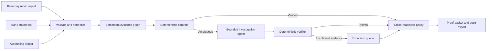

# Vouch

**Prove every settlement before the books close.**

Vouch is an evidence-grade finance controller for reconciling Razorpay settlement
activity across gateway reports, bank statements, and accounting ledgers. It
reconstructs each settlement, verifies the corresponding cash and ledger
movements, investigates ambiguous exceptions through a bounded AI agent, and
reports whether the settlement close is ready or blocked.

> **Project status:** Phase 1 backend foundation is complete; canonical schemas
> and financial value objects are next. All examples and evaluation data will be
> synthetic.

## The problem

A merchant can see a payment in Razorpay, a later net credit in its bank account,
and several related journal lines in its ledger. Proving that these records
describe the same economic event is harder than joining three identifiers:

- payments are grouped into settlements;
- fees, tax, refunds, transfers, and adjustments change the net amount;
- the bank sees a settlement credit rather than individual orders;
- ledger references can be incomplete or inconsistent;
- legitimate timing delays must not be reported as missing cash; and
- a plausible match is not necessarily sufficient evidence to close the books.

Finance teams repeatedly assemble that proof by hand. Vouch turns it into a
measured, reviewable control.

## What Vouch does

For each settlement, Vouch is designed to:

1. validate and normalize Razorpay, bank, and ledger inputs;
2. calculate the signed settlement total from authoritative credit and debit
   fields;
3. verify the bank credit using UTR, amount, timing, and uniqueness controls;
4. verify related ledger journals and the Razorpay clearing-account movement;
5. investigate only the unresolved tail with a bounded AI agent;
6. reject any AI hypothesis that cannot pass deterministic verification;
7. rank exceptions by materiality and operational urgency; and
8. issue an auditable `READY`, `READY_WITH_EXCEPTIONS`, or `BLOCKED` decision.

## Trust model

| Principle | Vouch's position |
| --- | --- |
| Financial truth | Derived from source evidence and deterministic invariants |
| Fuzzy matching | Candidate generation only; never proof by itself |
| AI authority | May investigate and propose; cannot directly clear a record |
| Uncertainty | Explicit abstention and honest exception reporting |
| Money representation | Integer currency subunits; never binary floating point |
| Auditability | Source lineage, rule versions, input fingerprints, and decision history |
| Ground truth | Available only to the evaluation harness, never the runtime engine |

## Intended workflow



## Initial scope

The first release covers one end-to-end finance-operations loop: closing a batch
of standard domestic Razorpay settlements against a bank statement and a
configured general ledger.

Included:

- payments, refunds, transfers, and adjustments;
- normal domestic settlement timing;
- UTR-based and evidence-backed fallback matching;
- balanced ledger journals and a Razorpay clearing account;
- optional balance-account partitioning;
- materiality-aware exceptions;
- a frozen held-out synthetic evaluation batch; and
- a local, provider-isolated AI investigation path.

Not included in the first release:

- money movement or writes to Razorpay, a bank, or an accounting system;
- production credentials or real merchant financial data;
- international, Instant, or Smart Settlement policies;
- general-purpose bookkeeping, forecasting, or tax advice; and
- a generic finance chatbot.

## Evaluation bar

Vouch will report match rate, link precision and recall, auto-clear precision,
coverage, money-weighted reconciliation rate, unresolved value, throughput, and
AI abstention/failure rates. The primary safety objective is **zero incorrect
auto-clears on the frozen held-out batch**. No performance number will be claimed
until it is reproduced by the evaluation harness.

## Repository map

```text
vouch/
├── backend/                  # Phase 1 backend foundation; future reconciliation engine and API
├── frontend/                 # Future review and close-readiness interface
├── data/                     # Synthetic-data policy and future fixtures
├── docs/
│   ├── adr/                  # Architecture decision records
│   ├── architecture.md
│   ├── data-contract.md
│   ├── evaluation.md
│   ├── product-spec.md
│   ├── references.md
│   ├── roadmap.md
│   └── safety-and-trust.md
├── AGENTS.md                 # Non-negotiable implementation guidance
├── CONTRIBUTING.md
├── SECURITY.md
└── README.md
```

## Documentation

- [Product specification](docs/product-spec.md)
- [System architecture](docs/architecture.md)
- [Canonical data contract](docs/data-contract.md)
- [Evaluation protocol](docs/evaluation.md)
- [Safety and trust model](docs/safety-and-trust.md)
- [Delivery roadmap](docs/roadmap.md)
- [Source references and verified assumptions](docs/references.md)
- [Architecture decisions](docs/adr/README.md)

## Buildathon context

Vouch is being designed for Track 04, **AI Finance Controller**, of the
[Razorpay AI Buildathon](https://razorpay.com/buildathon/). The track asks for an
agent that closes one finance-operations loop over 50 or more synthetic records
while reporting throughput, measured accuracy, and unresolved exceptions.

## Responsible-use notice

Vouch is a buildathon prototype, not an accounting certification, audit opinion,
or financial-advice product. Its close-readiness policy is an operational control
over synthetic data and must not be treated as a substitute for qualified review.
