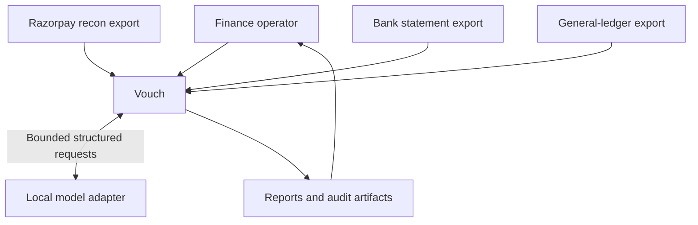
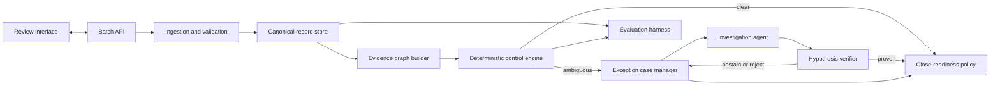

# System architecture

**Status:** Accepted for MVP  
**Last reviewed:** 2026-08-23

## Architecture drivers

Vouch is optimized for evidence quality, deterministic reproducibility, safe
failure, and clarity under review. The target batch is small enough that a local
modular application is more appropriate than distributed infrastructure.

## System context



The model is outside the financial authority boundary. It may inspect a curated
evidence package and return a hypothesis, but it cannot mutate source records,
post financial entries, or independently clear a case.

## Logical components



### Ingestion and validation

Responsibilities:

- parse supported CSV files;
- preserve raw values and source row numbers;
- fingerprint files;
- validate schema and batch scope;
- normalize timestamps, identifiers, direction, and integer money; and
- produce explicit row-level validation errors.

It does not perform matching.

### Canonical record store

SQLite holds batch metadata, immutable source records, canonical projections,
evidence links, decisions, exceptions, and audit events. Source files remain the
origin of truth; canonical records are versioned interpretations of that evidence.

### Evidence graph builder

The graph is a logical domain structure, not a graph database. It connects:

- Razorpay transaction rows to a settlement;
- settlement to UTR and candidate bank entries;
- transaction and settlement references to ledger journals; and
- every proposed relationship to the evidence that supports or contradicts it.

### Deterministic control engine

Controls run from strongest evidence to weakest:

1. schema and integrity controls;
2. settlement aggregation;
3. exact UTR and identifier matches;
4. amount, direction, date, currency, and uniqueness verification;
5. ledger journal-balance and account-role controls;
6. clearing-account residual control; and
7. candidate generation for unresolved cases.

Similarity scores never directly produce a cleared decision.

### Exception case manager

An exception is a first-class record containing its current state, materiality,
age, candidate links, failed controls, evidence package, investigation history,
and recommended next action.

### Investigation agent

The agent operates under a fixed step budget with read-only tools such as:

- retrieve a cited source record;
- list candidate bank or ledger records;
- calculate a settlement aggregate;
- validate a journal balance;
- check the configured settlement window; and
- submit a structured hypothesis or abstain.

Raw narration and notes are explicitly marked as untrusted data. The agent cannot
execute arbitrary code, issue network calls, or select records outside the current
case's evidence boundary.

### Hypothesis verifier

The verifier checks that:

- all cited records exist and are in scope;
- the proposed relationship satisfies accounting and uniqueness invariants;
- no record is reused incompatibly;
- the explanation agrees with calculated values; and
- the requested transition is permitted by the close policy.

Only the verifier can promote an agent-investigated case to a cleared state.

### Close-readiness policy

The policy evaluates materiality, age, resolution state, control severity, and
unresolved value. It is versioned and stored with the batch so the final decision
can be reproduced.

### Evaluation harness

Evaluation is a separate entry point. It loads runtime results and privately held
ground truth, calculates metrics, and emits a reproducible report. Runtime modules
must not import evaluation labels or ground-truth helpers.

## Core domain objects

| Object            | Purpose                                                           |
| ----------------- | ----------------------------------------------------------------- |
| `Batch`           | Scope, period, policy version, source fingerprints, and run state |
| `SourceRecord`    | Immutable raw row and source lineage                              |
| `GatewayMovement` | Canonical payment, refund, transfer, or adjustment                |
| `Settlement`      | Grouped gateway movement and expected signed net                  |
| `BankEntry`       | Canonical bank debit or credit                                    |
| `LedgerLine`      | Canonical debit or credit line within a journal                   |
| `EvidenceLink`    | Proposed or verified relationship between records                 |
| `Decision`        | State transition with reason, evidence, and resolver              |
| `ExceptionCase`   | Unresolved control failure or ambiguity                           |
| `AgentRun`        | Prompt/tool versions, steps, response, and verification result    |
| `CloseAssessment` | Reproducible ready, ready-with-exceptions, or blocked result      |

## Decision hierarchy

When evidence conflicts, Vouch applies the following authority order:

1. input-integrity and scope controls;
2. canonical arithmetic and accounting invariants;
3. exact identifiers validated by independent attributes;
4. configured deterministic rules;
5. agent-proposed hypotheses accepted by the verifier;
6. human review outside the automated close result.

No lower authority may override a failed higher-authority control.

## Persistence and audit design

The MVP uses SQLite through a repository layer. Domain logic must not depend on
SQLAlchemy models directly.

Audit records are append-only at the application layer and capture:

- batch and decision IDs;
- raw and canonical source-row IDs;
- input SHA-256 fingerprints;
- rule, policy, schema, and prompt versions;
- before and after states;
- calculated evidence values;
- resolver type (`rule`, `agent_verified`, or `manual_review`); and
- timestamp in UTC.

## API boundary

The planned minimal API surface is:

```text
POST /batches
POST /batches/{batch_id}/sources
POST /batches/{batch_id}/reconcile
GET  /batches/{batch_id}
GET  /batches/{batch_id}/settlements
GET  /batches/{batch_id}/exceptions
POST /exceptions/{case_id}/investigate
GET  /batches/{batch_id}/exports/{artifact}
```

Route handlers orchestrate use cases and serialize contracts. They must not
contain reconciliation or accounting logic.

## Failure behavior

| Failure                       | Required behavior                                           |
| ----------------------------- | ----------------------------------------------------------- |
| Missing required column       | Reject source with actionable validation errors             |
| Malformed money or timestamp  | Reject row; do not coerce silently                          |
| Duplicate source identity     | Block affected evidence scope                               |
| Conflicting exact identifiers | Create critical exception                                   |
| Multiple fuzzy candidates     | Preserve all candidates and abstain                         |
| Model unavailable             | Continue deterministic processing and mark cases for review |
| Invalid model output          | Record failure and abstain                                  |
| Ground-truth access attempt   | Fail evaluation isolation test                              |
| Unsupported settlement policy | Exclude or reject explicitly                                |

## Deployment shape

The initial product runs locally:

- React and TypeScript interface;
- FastAPI application;
- SQLite database;
- optional local Ollama-compatible model endpoint.

No networked queue, cache, graph database, or external model is required. Docker
may be added for reproducibility, but the local model remains an optional adapter
so the core workflow cannot be held hostage by model availability.
