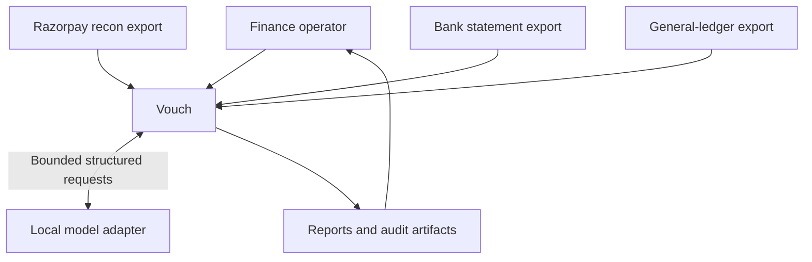
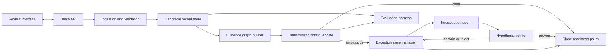

# System architecture

**Status:** Accepted for MVP  
**Last reviewed:** 2026-08-23

## Architecture drivers

Vouch is optimized for evidence quality, deterministic reproducibility, safe
failure, and clarity under review. The target batch is small enough that a local
modular application is more appropriate than distributed infrastructure.

## System context

The model is outside the financial authority boundary. It may inspect a curated
evidence package and return a hypothesis, but it cannot mutate source records,
post financial entries, or independently clear a case.

## Logical components

### Ingestion and validation

Responsibilities:

- parse supported CSV files;
- preserve raw values and source row numbers;
- fingerprint files;
- validate schema and batch scope;
- normalize timestamps, identifiers, direction, and integer money; and
- produce explicit row-level validation errors.

It does not perform matching.

### Canonical record store

Phase 4 keeps batch metadata, immutable source records, canonical projections,
evidence links, decisions, exceptions, and audit events in an in-memory result.
Persistence remains a later-phase adapter. Source files remain the origin of
truth; canonical records are versioned interpretations of that evidence.
The Phase 2 domain boundary is framework-independent and currently provides
`SourceLineage`, `RawEvidence`, `Money`, `GatewayMovement`, `BankEntry`,
`LedgerLine`, and `ClosePolicy`. Each projection retains scalar raw values and
source identity. Phase 4 application services aggregate settlements, calculate
journal residuals, link records, and emit immutable decisions without importing
filesystem or framework concerns into the domain.

Phase 3 adds `backend/synthetic_data/` as a generator-only package. It may
import canonical contracts from `app.domain`, but `backend/app/` does not import
the generator, scenario registry, ground-truth schema, or ground-truth paths.
Generated runtime inputs and manifests are separate from
`data/ground_truth/<dataset>/`; the wheel build packages only `app`. An AST
architecture test and the dataset verifier enforce this boundary.
Ground truth is produced from final input fingerprints and one-based data-row
numbers in a separate write step. The independent verifier reads emitted files
from disk and checks scenario evidence, timing, accounting, materiality, and
reference resolution without consulting generator traits.

### Evidence graph builder

The graph is a logical domain structure, not a graph database. It connects:

- Razorpay transaction rows to a settlement;
- settlement to UTR and candidate bank entries;
- each gateway movement to its exact ledger evidence pair, with one movement
  link per assignment; settlement bank/clearing postings are separate
  settlement-level links; and
- every proposed relationship to the evidence that supports or contradicts it.

### Deterministic control engine (Phase 4)

Controls run from strongest evidence to weakest:

1. schema and integrity controls;
2. settlement aggregation;
3. exact UTR and identifier matches;
4. amount, direction, date, currency, and uniqueness verification;
5. journal-balance controls and configured ledger account-role controls;
6. clearing-account residual control; and
7. candidate generation for unresolved cases.

Similarity scores never directly produce a cleared decision.

Ledger lineage is deliberately movement-scoped. A `gateway_to_ledger` link
contains one gateway source record, only the ledger source records assigned to
that movement, and one journal ID. It never aggregates unrelated movements.
Settlement-level bank and clearing postings use a separate
`settlement_to_ledger` link. Assignment consumes journal evidence once, and
ambiguous, swapped, reused, duplicate, or missing lines remain proposed or
rejected with explicit reasons. A verified movement pair must also satisfy the
configured counterpart role and debit/credit direction; role or direction
mismatches are blocking controls for every movement type.

Runtime precedence is: source/schema integrity; canonical settlement arithmetic
and ledger controls; exact UTR plus independent direction, currency, amount,
partition, timing, uniqueness, and one-use checks; configured explanations;
fallback candidates; then SLA/materiality close policy. Critical integrity or
overdue conditions dominate pending and clearing states. The evaluation clock is
always passed explicitly; no system clock is read.

### Exception case manager

An exception is a first-class record containing its current state, materiality,
age, candidate links, failed controls, evidence package, investigation history,
and recommended next action.

### Investigation agent (planned after Phase 2)

The agent operates under a fixed step budget with read-only tools such as:

- retrieve a cited source record;
- list candidate bank or ledger records;
- calculate a settlement aggregate;
- inspect configured ledger evidence;
- request deterministic journal-balance validation;
- check the configured settlement window; and
- submit a structured hypothesis or abstain.

Raw narration and notes are explicitly marked as untrusted data. The agent cannot
execute arbitrary code, issue network calls, or select records outside the current
case's evidence boundary.

### Hypothesis verifier

The verifier checks that:

- all cited records exist and are in scope;
- the proposed relationship satisfies accounting and uniqueness invariants;
- no record is reused incompatibly;
- the explanation agrees with calculated values; and
- the requested transition is permitted by the close policy.

Only the verifier can promote an agent-investigated case to a cleared state.

### Close-readiness policy

The policy evaluates materiality, age, resolution state, control severity, and
unresolved value. It is versioned and stored with the batch so the final decision
can be reproduced.

### Evaluation harness

Evaluation is a separate entry point under `backend/evaluation/`. It validates
runtime inputs and manifests, runs the label-free Phase 4 engine, saves canonical
`runtime-result.json`, checks that the result contains no label-only fields, and
only then opens private ground truth through the evaluation-only adapter. It
checks dataset identity, source fingerprints, fixed clock, schema, rule, policy,
and ground-truth schema versions before scoring.

The harness emits deterministic `metrics.json` and `summary.md` plus a separate
wall-clock `operational.json`. It uses exact source-record relationships, keeps
integer ratio counts, names settlement-net absolute value as the sole money
basis, and fails applicable release gates for false auto-clears, missed material
exceptions, readiness disagreement, invalid cleared lineage, incompatible
record reuse, identity mismatch, or non-reproducible reports. The application
wheel continues to contain only `app/` and dist-info.

## Core domain objects

| Object            | Purpose                                                           |
| ----------------- | ----------------------------------------------------------------- |
| `Batch`           | Scope, period, policy version, source fingerprints, and run state |
| `SourceRecord`    | Immutable raw row and source lineage                              |
| `GatewayMovement` | Canonical payment, refund, transfer, or adjustment                |
| `Settlement`      | Grouped gateway movement and expected signed net                  |
| `BankEntry`       | Canonical bank debit or credit                                    |
| `LedgerLine`      | Canonical debit or credit line within a journal                   |
| `EvidenceLink`    | Proposed or verified relationship between records                 |
| `Decision`        | State transition with reason, evidence, and resolver              |
| `ExceptionCase`   | Unresolved control failure or ambiguity                           |
| `AgentRun`        | Prompt/tool versions, steps, response, and verification result    |
| `CloseAssessment` | Reproducible ready, ready-with-exceptions, or blocked result      |

## Decision hierarchy

When evidence conflicts, Vouch applies the following authority order:

1. input-integrity and scope controls;
2. canonical arithmetic and accounting invariants;
3. exact identifiers validated by independent attributes;
4. configured deterministic rules;
5. agent-proposed hypotheses accepted by the verifier;
6. human review outside the automated close result.

No lower authority may override a failed higher-authority control.

## Persistence and audit design

Phase 4 has no repository or database implementation. A future persistence
adapter may use the accepted local architecture, but domain logic must not depend
on persistence models directly.

Audit records are append-only at the application layer and capture:

- batch and decision IDs;
- raw and canonical source-row IDs;
- input SHA-256 fingerprints;
- rule, policy, and schema versions;
- before and after states;
- calculated evidence values;
- resolver type (`rule`, `agent_verified`, or `manual_review`); and
- timestamp in UTC.

The Phase 4 runtime emits one evidence-link audit event for every accepted or
proposed movement-level assignment, preserving the exact cited source IDs and
calculated line count. Candidate bank signals and settlement-level posting
evidence are retained in their own link or candidate events.

## API boundary

Phase 6 exposes the versioned synchronous surface documented in
`docs/api-contract.md`: batch creation, four immutable source uploads,
reconciliation runs, batch/result/settlement/exception/close/audit reads, and
canonical result, exception, and audit exports. Route handlers validate HTTP
input, invoke the injected `BatchWorkflowService`, map safe errors, and
serialize immutable Pydantic contracts. They contain no reconciliation,
matching, accounting, materiality, or close-readiness policy.

The current repository is a concurrency-safe in-memory implementation. It
preserves raw upload bytes and metadata and stores one immutable `BatchResult`,
but all state is lost on process restart. It uses generated internal workspace
filenames and never treats client filenames as paths. Reconciliation is
synchronous and always receives the batch's explicit evaluation clock.

## Failure behavior

| Failure                       | Required behavior                                           |
| ----------------------------- | ----------------------------------------------------------- |
| Missing required column       | Reject source with actionable validation errors             |
| Malformed money or timestamp  | Reject row; do not coerce silently                          |
| Duplicate source identity     | Block affected evidence scope                               |
| Conflicting exact identifiers | Create critical exception                                   |
| Multiple fuzzy candidates     | Preserve all candidates and abstain                         |
| Model unavailable             | Continue deterministic processing and mark cases for review |
| Invalid model output          | Record failure and abstain                                  |
| Ground-truth access attempt   | Fail evaluation isolation test                              |
| Unsupported settlement policy | Exclude or reject explicitly                                |

## Deployment shape

Phase 6 runs locally as a FastAPI application with an in-memory batch repository.
The React interface, durable SQLite adapter, and optional local
Ollama-compatible model endpoint remain later-phase components. No networked
queue, cache, graph database, or external model is required. A future SQLite
adapter remains compatible with the repository boundary recorded in ADR 0004
and ADR 0008.
