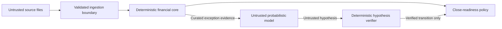

# Safety and trust model

**Status:** Accepted for MVP  
**Last reviewed:** 2026-08-23

## Safety objective

Vouch should automate evidence gathering without automating unsupported financial
belief. Its primary unsafe failure is a false auto-clear: presenting an incorrect
or insufficiently supported relationship as safe to close.

## Trust boundaries

Both source text and model output are untrusted. Arithmetic, record identity,
scope, uniqueness, journal balance, materiality, and state transitions remain in
the deterministic boundary.

## Action boundary

The MVP is read-only. It cannot:

- move money;
- retry, refund, or capture a payment;
- contact a customer, bank, or merchant;
- post, alter, or delete a ledger journal;
- approve an accounting close in an external system; or
- access production Razorpay or bank credentials.

Its strongest action is to produce an evidence-backed recommendation and export.

## Agent permissions

The investigation agent receives a single exception case and a curated evidence
scope. It may:

- request existing records by allowed ID;
- request deterministic calculations;
- compare candidate explanations;
- submit a schema-valid hypothesis; or
- abstain.

It may not:

- execute code or shell commands;
- browse the network;
- access files directly;
- retrieve another batch;
- create identifiers that were not supplied by a tool;
- alter materiality or settlement policy;
- mark a case as cleared; or
- exceed its configured step or time budget.

## Hypothesis verification

A hypothesis is rejected unless:

- every cited source record exists and is inside the case scope;
- calculated values match the hypothesis;
- required identifiers and independent controls agree;
- journal and clearing-account invariants pass;
- candidate uniqueness is established;
- no higher-authority control contradicts it; and
- the proposed transition is permitted by policy.

Model confidence does not satisfy any of these requirements.

## Threat catalogue

| Threat                                       | Control                                                                                  |
| -------------------------------------------- | ---------------------------------------------------------------------------------------- |
| False exact match from duplicated identifier | Independent amount, scope, direction, time, and uniqueness controls                      |
| False fuzzy match from amount/date collision | Candidate-only similarity and mandatory verifier                                         |
| Prompt injection in narration or notes       | Treat source text as quoted data; fixed tools; structured output; no arbitrary execution |
| Hallucinated source record                   | Reject identifiers not returned by allowed tools                                         |
| Malformed model JSON                         | Schema validation, bounded retry, then abstain                                           |
| Model unavailable or slow                    | Deterministic workflow continues; unresolved case remains visible                        |
| Ground-truth leakage                         | Separate package/path and architectural import test                                      |
| Evidence substitution                        | Source SHA-256 fingerprints stored with every run                                        |
| Silent parser coercion                       | Strict validation and explicit rejected-row report                                       |
| Floating-point drift                         | Integer currency subunits throughout                                                     |
| Time-dependent test instability              | Frozen evaluation clock and versioned SLA policy                                         |
| CSV formula injection on export              | Escape spreadsheet formula prefixes in untrusted text fields                             |
| Cross-balance false link                     | Hard partition on balance account when present                                           |
| Real-data exposure                           | Synthetic-only repository; local model default; secrets ignored                          |

## Privacy model

The public project contains synthetic data only. Local uploads are ignored by
version control and are not sent to a remote model by default. The model adapter
must make its destination explicit, and a non-local provider cannot become the
default without a new accepted ADR.

## Safe degradation

| Component failure             | System response                                               |
| ----------------------------- | ------------------------------------------------------------- |
| AI disabled                   | Complete deterministic pass; leave ambiguous cases for review |
| AI response invalid           | Record model failure and abstain                              |
| SQLite write failure          | Fail the run; do not emit an unaudited close decision         |
| Partial source upload         | Keep batch incomplete; do not reconcile                       |
| Unsupported transaction class | Exclude or reject explicitly according to policy              |
| Conflicting source evidence   | Create critical exception                                     |
| Export failure                | Preserve stored decisions and allow retry                     |

## Phase 6 API boundary

The HTTP layer is an evidence-preserving transport boundary, not a second
reconciliation engine. It requires an explicit evaluation clock, caps source
uploads at 10 MiB by default, preserves raw bytes and SHA-256 fingerprints, and
rejects unsupported content types, invalid UTF-8, and fatal source-format
errors. Identical uploads are idempotent; replacements conflict; sources become
immutable when a run starts. Failed runs retain only safe failure metadata and
never expose partial results.

The Phase 6 repository is process-local and has no authentication,
authorization, tenancy, rate limiting, durable retention, or restart recovery.
It must not be exposed as a production financial control endpoint.

## Phase 7 frontend boundary

The React client is a read-only review surface over the Phase 6 and Phase 8 API.
It has no manual clear, override, money movement, journal-posting,
authentication, or tenancy controls. The investigation button is shown only for
an API-eligible `needs_review` settlement with `provider_available=true`. The run button is enabled only when the API reports both conditions,
and navigation to review begins only after the API reports a completed result.
Accepted decisions disable further invocation. Critical UTR-collision cases do
not expose an actionable investigation control. Public HTTP cancellation is not
claimed; the backend only supports internal per-run cancellation at its
orchestration boundary.
Uploads retain independent status and show stable API error codes; a conflict or
immutable-source response cannot be rendered as a successful replacement.

The browser does not persist uploaded bytes or complete results in localStorage,
does not log source content, and does not reinterpret server exports. Proposed
and rejected evidence are labelled separately from verified evidence. Filenames,
explanations, identifiers, and raw values are treated as untrusted text. The
investigation panel shows read-only traces and verifier results while keeping
base and effective close assessments separate. A same-origin production build
and a narrow local Vite proxy keep the API boundary explicit; neither creates
authentication or production tenancy.

## Human review

Human review is not a mechanism for silently overriding evidence. A future manual
resolution must require a reason, actor, timestamp, and cited evidence, and it must
append a new decision rather than mutating history.

## Known limitations

- Synthetic data cannot reproduce every merchant accounting policy.
- A local language model may be inconsistent or unavailable.
- The MVP does not establish production security, access control, retention, or
  regulatory compliance.
- Close readiness is scoped to Razorpay settlement evidence, not the merchant's
  entire cash or financial close.
- Results are an operational aid, not an audit opinion.
